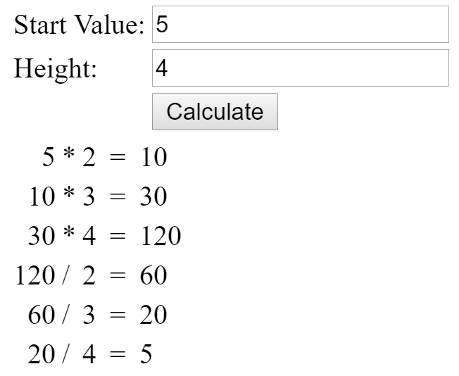
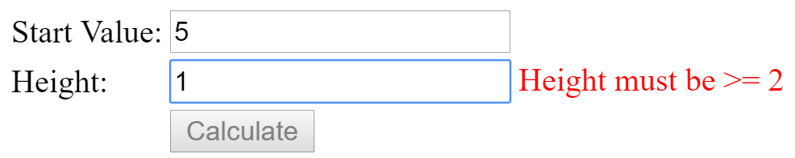

# *Turmrechnen*

## Introduction

In this exercise you have to implement a tool for the mathematical exercise [*Turmrechnen*](http://www.floriangeier.at/schule/kopf/kopf.php) with Angular.

## Requirements

* The exercise has to be implement with *Blazor* (server- or client-side)
* Create two input fields for the parameter of the *Turm*
* Create a button with which the calculation can be started.
* Display all steps of the *Turm* as shown in the following screenshot:

* If the parameter *height* is < 2, display an error message in red as shown in the following screenshot:

